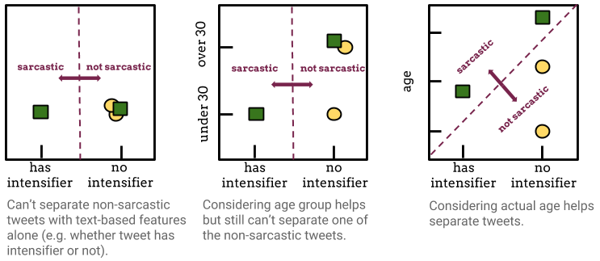

# User-Factor Adaptation

User-factor adaptation is the problem of adapting NLP models to real-valued human attributes, or *factors*, that capture fine-grained differences between individuals. These factors can include both known factors (e.g. demographics, personality) and latent factors that can be inferred simply from an unlabeled collection of a person's tweets. Our approach to user-factor adaptation is similar to feature augmentation, a common technique in domain adaptation, with the addition of being able to adapt to continuous variables. We find that we can improve on popular NLP tasks by putting language back into its human context.

To encourage further research, we provide some of the datasets we used, code to generate factors for Twitter users, and a complete stance detection system with user-factor adaptation.

## Downloads

+ User-factor adaptation for stance detection
+ PP-attachment dataset
+ User factor inference code

## Publications

[Human Centered NLP with User-Factor Adaptation](http://lunr.cs.stonybrook.edu/sites/lunr.cs.stonybrook.edu/files/userfactors_emnlp2017.pdf)

Veronica E. Lynn, Youngseo Son, Vivek Kulkarni, Niranjan Balasubramanian, and H. Andrew Schwartz

In EMNLP 2017

## Team

+ [Veronica Lynn](http://www.veronicaelynn.com)
+ [Youngseo Son](http://www3.cs.stonybrook.edu/~yson/)
+ [Vivek Kulkarni](http://viveksck.github.io/)
+ [Niranjan Balasubramanian](http://www3.cs.stonybrook.edu/~niranjan/)
+ [Andy Schwartz](http://www3.cs.stonybrook.edu/~has/)

## Contact

For questions, please contact [Veronica Lynn](mailto:velynn@cs.stonybrook.edu).
